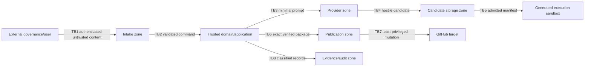

# Security Architecture

> **Approval boundary correction:** portfolio approval truth and router admission are outside Slugger. Only canonical `approved` is admitted; `queued` is not authorization, and material change gets a new task and approval. Slugger authenticates the admitted caller and validates the immutable request/local policy, never a live label or second approval. Phase credentials separate Codex, validation, publication, and result delivery; normal conformance CI has none.

## Security objectives and model

Protect authority, Slugger/source/target integrity, secrets and confidential intent; contain untrusted generated behavior; preserve auditable truth; and deny consequential action under uncertainty. Zero trust applies across every external, adapter, generated-code and extension boundary. Threat analysis must be refreshed per capability profile and integration.

## Trust boundaries

Generation has provider credentials only; sandbox has approved dependency access only when policy permits and never provider/publication secrets; publication has target credentials only and consumes immutable verified bytes; interface/control plane credentials do not enter candidate zones.

## Authentication and authorization

Authenticate the routed caller and transport before validating the canonical payload. Authorization evaluates actor, mode, immutable input, permitted task type, exact target, contract compatibility, draft-only policy, and local policy. Deny by default. Registration is not approval; provider success is not authorization; labels/text cannot grant authority. Reconcile local policy and deterministic delivery ownership before mutation, but do not re-read source approval. Policy exceptions are scoped, attributable, expiring, audited, and cannot override BR-30 prohibitions.

## Secrets management

Use a credential authority and opaque, short-lived, least-privilege phase handles; rotate/revoke without code change. Never commit secrets, place them in prompts/candidates/evidence/logs/command lines, inherit them into generated processes, or expose them across phases. Apply output redaction and secret canaries/scanning. Suspected disclosure stops publication, preserves sanitized evidence, revokes credentials and invokes incident response.

## Integrity and confidentiality

Canonicalize then digest immutable request fields; hash all artifacts; bind gate/evidence/publication records to qualified digests and versions. Protect state/evidence against unauthorized modification and detect rollback/tampering. Encrypt classified data in transit and at rest according to deployment policy; restrict views by purpose/role; minimize provider disclosure; classify and redact before export. Evidence links honor the source classification and must not become public merely because a PR is public.

## Threat register

| Threat | Control expectations |
|---|---|
| Prompt injection in issue/README/generated text | Parse authoritative fields separately; text is data; fixed policy/system boundary; no tool authority from content. |
| Path traversal, links, devices, archive bombs | Normalization, containment, link/special-file denial, quotas, streaming inventory, adversarial corpus. |
| Malicious build/test/dependency | Static admission first; approved immutable sources; network/process/resource sandbox; no secrets; timeouts. |
| Supply-chain substitution | Pinned/integrity-qualified resolution, provenance, cache verification, revocation policy, evidence. |
| Contract/replay/confused deputy | Authenticated canonical envelope, audience/target/mode, stable delivery/digest, freshness, authoritative validator. |
| Duplicate/race/target takeover | Durable ownership/CAS, deterministic identity, versioned marker, base/head/draft uniqueness, no name-only trust. |
| Secret exfiltration via output/log/artifact | Phase isolation, redaction, output bounds, manifest allowlist, canary tests, block publication. |
| Tampered/stale evidence | Immutable digests, access control, append-only audit, subject/tool/config bindings and freshness engine. |
| Extension/provider compromise | Least privilege, conformance, isolation, kill switch, signed provenance where required, no direct gate/publication access. |
| Denial of service/cost abuse | Authentication, quotas, size/token/time limits, backpressure, cancellation, budget-aware retry. |
| Insider/automation overreach | Separation of duties, audit, no self-approval/merge/release/deploy, reviewable draft boundary. |

## Auditability and privacy

Audit security decisions, authority checks, credential issue/use (not values), policy/config versions, access, exceptions, target classification, and cleanup. Make actor/cause/time/correlation and before/after state explicit. Define retention/export/deletion and legal/privacy requirements before production; deletion emits a non-sensitive tombstone. Optional telemetry is off or minimized for sensitive content.

## Security verification

Required assurance includes threat-model review, SAST/dependency/license/secret checks for Slugger, contract/auth negative tests, malicious candidate corpus, sandbox escape and egress tests, credential canaries, concurrency/ownership tests, evidence tamper tests, access/redaction tests, incident exercises, and independent human approval. No narrow verifier result asserts production security.
