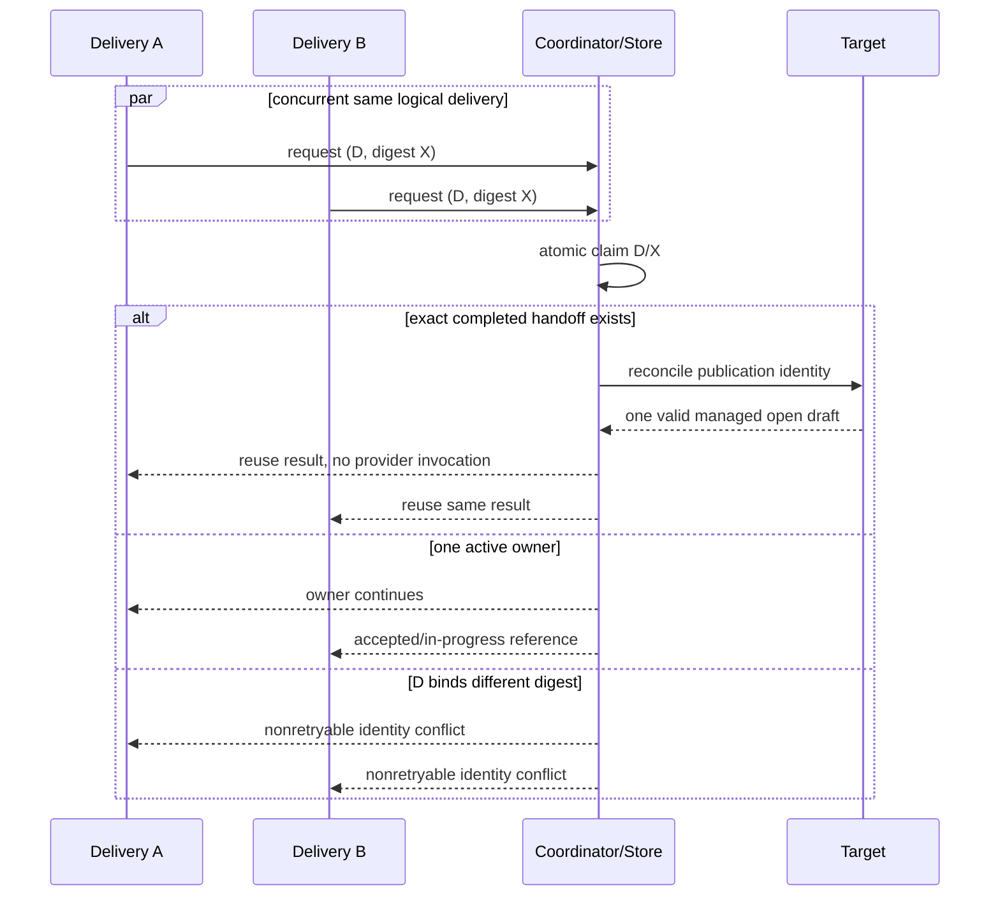
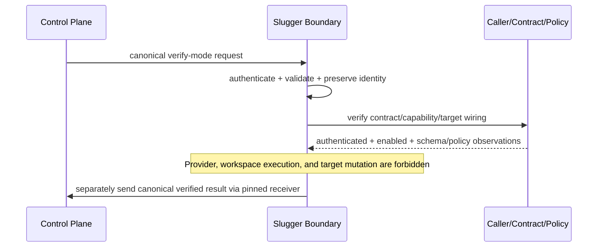

# Sequence Diagrams

> For organization next-MVP interpretation, only canonical `approved` is admitted by the router. Slugger authenticates the admitted caller and validates the pinned input/local policy; it never performs a live label or source-approval recheck. `verify` calls neither Codex nor publication. Every terminal/rejected/ambiguous flow creates a canonical result and separately attempts the pinned receiver. See [`docs/next-mvp.md`](../next-mvp.md#target-capability-mutable-activation-and-admission).

## Primary approved generation and draft handoff

```mermaid
sequenceDiagram
  autonumber
  participant CP as Control Plane
  participant IN as Contract Boundary
  participant AU as Caller Auth/Local Policy
  participant RC as Run Coordinator
  participant PV as Provider Gateway
  participant VF as Inventory/Verifier
  participant EV as Evidence/Gates
  participant GH as Target Adapter
  participant HR as Human Reviewer
  CP->>IN: execution_input_json + concurrency_group
  IN->>IN: authenticate + authoritative validate
  IN->>AU: authenticate caller + evaluate local policy
  AU-->>IN: authenticated + enabled + supported + in scope
  IN->>RC: accept delivery
  RC->>RC: claim identity; persist run/phase intent
  RC->>GH: early target preflight (read only)
  GH-->>RC: safe new/managed classification
  RC->>PV: bounded generation request + operation ID
  PV-->>RC: untrusted candidate receipt
  RC->>VF: contain, inventory, admit, install/test/smoke
  VF-->>RC: manifest + observed check records
  RC->>EV: assemble and evaluate exact bindings
  EV-->>RC: sealed evidence + all current PASS
  RC->>AU: recheck unchanged input + local policy
  AU-->>RC: permitted
  RC->>GH: final preflight + exact manifest/evidence
  GH->>GH: reconcile/create/update only proven owned draft
  GH-->>RC: deterministic branch + draft reference
  RC->>RC: commit handoff and terminal outcome
  RC-->>IN: truthful result
  IN-->>CP: canonical validated result
  GH-->>HR: draft and reviewer evidence
```

## Duplicate and concurrent delivery alternate flow



## Validation failure flow

```mermaid
sequenceDiagram
  participant RC as Coordinator
  participant IV as Inventory/Validator
  participant EV as Evidence
  participant PB as Publication
  RC->>IV: candidate
  IV-->>RC: FAIL (unsafe path/dependency/content)
  RC->>EV: record scoped observation and invalidated downstream gates
  EV-->>RC: failure evidence reference
  RC-->>PB: no call (publication denied)
  RC->>RC: terminal FailedPolicy/Validation
  Note over RC: Candidate remains contained; cleanup follows retention policy
```

## Interruption, resume, and ambiguous side effect

```mermaid
sequenceDiagram
  participant OP as Operator/Redelivery
  participant RC as Coordinator
  participant ST as Durable Store
  participant X as External Adapter
  OP->>RC: resume delivery/run
  RC->>ST: load last committed state + pending operation
  ST-->>RC: phase intent exists; completion absent
  RC->>X: reconcile stable operation identity (read only)
  alt completion proven exact
    X-->>RC: observed completed output/ref
    RC->>ST: commit observation + next state
  else definitely not performed and retryable
    X-->>RC: absent
    RC->>X: retry same operation within budget
    X-->>RC: typed result
    RC->>ST: commit result
  else ambiguous/conflicting
    X-->>RC: cannot prove ownership/outcome
    RC->>ST: transition Blocked/ManualReconciliation
    RC-->>OP: safe diagnostic + human action
  end
```

## Local policy change before publication

```mermaid
sequenceDiagram
  participant RC as Coordinator
  participant AU as Local Policy
  participant GH as Target
  RC->>AU: reconcile unchanged input/local policy/target
  AU-->>RC: denied or unverifiable
  RC->>RC: invalidate publication permission
  RC-->>GH: no mutation
  RC->>RC: create canonical blocked/rejected result
  Note over RC: Existing target state is preserved; source approval is not re-read or edited
```

## Verification-only routed request


